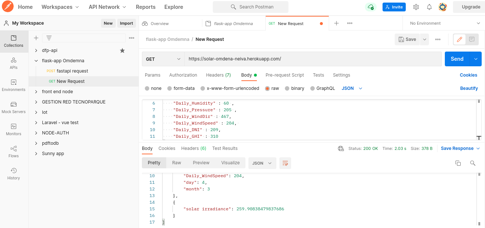

# Solar Cast App - Radiance determinator 

## Neiva - Huila Data 

This repository contain the data of time series for 2019 in the Neiva Huila data generated from solcast.com.au. Has repositories for data clean, exploratory and models to determine the radiation according to other related data. Has a flask-app that was implemented on heroku 

## Test
### URL

https://solar-omdena-neiva.herokuapp.com/

- ** input parameter: 
       'month', 'day', 'Daily_Temp', 'Daily_Precip', 'Daily_Humidity',
       'Daily_Pressure', 'Daily_WindDir', 'Daily_WindSpeed', 'Daily_DNI',
       'Daily_GHI'
- ** output parameter: 
        'Daily_radiation'

---
### Screenshots

#### Heroku

#### Mlflow

#### Neptune

