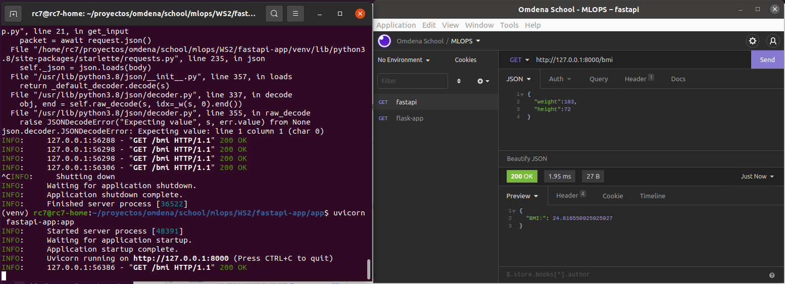

## Run commands

```bash
source ./WS2/fastapi-app/venv/bin/activate
pip install -r requirements.txt
python3 app.fastapi-app.py
```

## Test

- **inputs:** height(_inches_), weight(_pounds_)
- **outputs:** BMI

---


